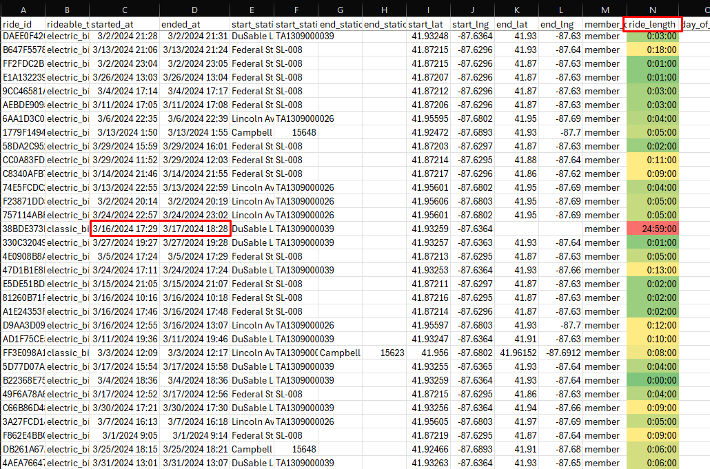

# Cyclistic Case Study – Google Data Analytics Capstone

Hi, and welcome to my capstone project for Google’s Data Analytics Professional Certificate!

In this project, I complete a case study which takes me through all phases of the data analysis process. Before I go into the details of the process, I’ll lay out the scenario:  

---

## Project Scenario

You are a junior data analyst working on the marketing analyst team at Cyclistic, a bike-share company in Chicago. The director of marketing believes the company’s future success depends on maximizing the number of annual memberships. Therefore, your team wants to understand how casual riders and annual members use Cyclistic bikes differently. From these insights, your team will design a new marketing strategy to convert casual riders into annual members. But first, Cyclistic executives must approve your recommendations, so they must be backed up with compelling data insights and professional data visualizations.

**Characters and teams:**
- **Cyclistic**: A bike-share program that features more than 5,800 bicycles and 600 docking stations. Cyclistic sets itself apart by also offering reclining bikes, hand tricycles, and cargo bikes, making bike-share more inclusive to people with disabilities and riders who can’t use a standard two-wheeled bike. The majority of riders opt for traditional bikes; about 8% of riders use the assistive options. Cyclistic users are more likely to ride for leisure, but about 30% use the bikes to commute to work each day.  
- **Lily Moreno**: The director of marketing and your manager. Moreno is responsible for the development of campaigns and initiatives to promote the bike-share program. These may include email, social media, and other channels. 
- **Cyclistic marketing analytics team**: A team of data analysts who are responsible for collecting, analyzing, and reporting data that helps guide Cyclistic marketing strategy. You joined this team six months ago and have been busy learning about Cyclistic’s mission and business goals—as well as how you, as a junior data analyst, can help Cyclistic achieve them. 
- **Cyclistic executive team**: The notoriously detail-oriented executive team will decide whether to approve the recommended marketing program.

### About the Company

In 2016, Cyclistic launched a successful bike-share offering. Since then, the program has grown to a fleet of 5,824 bicycles that are geotracked and locked into a network of 692 stations across Chicago. The bikes can be unlocked from one station and returned to any other station in the system anytime. Until now, Cyclistic’s marketing strategy relied on building general awareness and appealing to broad consumer segments. One approach that helped make these things possible was the flexibility of its pricing plans: single-ride passes, full-day passes, and annual memberships. Customers who purchase single-ride or full-day passes are referred to as casual riders. Customers who purchase annual memberships are Cyclistic members. Cyclistic’s finance analysts have concluded that annual members are much more profitable than casual riders. Although the pricing flexibility helps Cyclistic attract more customers, Moreno believes that maximizing the number of annual members will be key to future growth. Rather than creating a marketing campaign that targets all-new customers, Moreno believes there is a solid opportunity to convert casual riders into members. She notes that casual riders are already aware of the Cyclistic program and have chosen Cyclistic for their mobility needs. Moreno has set a clear goal: Design marketing strategies aimed at converting casual riders into annual members. In order to do that, however, the team needs to better understand how annual members and casual riders differ, why casual riders would buy a membership, and how digital media could affect their marketing tactics. Moreno and her team are interested in analyzing the Cyclistic historical bike trip data to identify trends.

---

## Business Questions

Three questions will guide the future marketing program: 

1. How do annual members and casual riders use Cyclistic bikes differently? 
2. Why would casual riders buy Cyclistic annual memberships? 
3. How can Cyclistic use digital media to influence casual riders to become members? 

**My focus:**  
Moreno has assigned me the first question to answer:  
**How do annual members and casual riders use Cyclistic bikes differently?**

---

## Ask Phase

I now have the context for the scenario and the question we're trying to answer, but it's important to dig a little deeper. What exactly is the problem I'm trying to solve, and how can my insights drive business decisions? 
In order to get a clear objective here, I write out a statement of the business task:

**Using Cyclistic’s historical trip data, identify the key differences between how annual members and casual riders use Cyclistic bikes. After identifying these differences, propose three recommendations to convert casual riders into annual members.**

With this statement in mind, our intentions and goals throughout this project are unambiguous and straightforward - We're trying to convert casual riders into annual members, and to do that we must understand how each type of rider utilizes Cyclistic differently. Once we understand the differences, we can cater to casual riders to drive sales for annual memberships. 

## Prepare Phase

With the statement of the business task laid out, I begin to gather the data I need to get started. Cyclistic has historical trip data [found here](https://divvy-tripdata.s3.amazonaws.com/index.html). There are a lot of months and years to choose from, but for my purposes, I chose the year 2024 as it is the most recent and complete year containing data for all months. Each month is its own file so I'm working with 12 separate excel files. The columns and headers for each file are consistent with one another and they contain the following headers:

- ride_id
- rideable_type
- started_at
- ended_at
- start_station_name
- start_station_id
- end_station_name
- end_station_id
- start_lat
- start_lng
- end_lat
- end_lng
- member_casual

With this type of data, there are a lot of avenues to explore how casual and member riders use Cyclistic differently! There's information on what kind of rideable is being used, when a ride started and ended, geographical data, and perhaps most importantly we get to see whether a ride was taken by a member or a casual rider.

## Process Phase

Now, while the data is consistent across all of the months, it's not ready for analysis yet. The first thing I'd like to do while I'm working with the files in Excel, is add some new columns to give each record some more information to work with. The columns I add are ride_length, day_of_week and month_of_year. These new columns will give a bit more context for each ride and make it easier to make calculations and comparisons between data later.

- ride_length: In order to calculate the duration of each ride, I simply subtracted the existing start_time from end_time columns for each row in Excel.
- day_of_week: To extract the day of the week of each ride, I use the function WEEKDAY on each ride's start_time.
- month_of_year: Similarly to day_of_week, I extract the month using the MONTH function from the date provided from start_time.

After adding these columns, I can start cleaning the data. With the use of conditional formatting on the newly added ride_length column, I can quickly scan through the data for outliers.

A ride length of this duration is more than likely an issue and doesn't reflect the real duration of the ride. 

I want to get rid of all results like this, but instead of manually scanning through thousands of records to remove each outlier, I use Excel's IF function to to test for a specific condition.

I settle on marking rows that have a ride duration over 12 hours as "Too Long". While it is possible to have a legitimate ride last more than 12 hours, I recognize that a vast majority of the other records exceeding this time will be errors; whether it be from Cyclistic's hardware or from human error not docking the rideable properly when finished. 

Now that the rows exceeding 12 hours have been marked as "Too Long" I can filter by just the rows matching that result and delete them in one chunk.

## Repository Contents

- `datasets/` - The datasets used in this project.
- `sql/` – Contains SQL queries and scripts used for data wrangling and analysis.
- `visualizations/` – For Tableau dashboard files and other visualizations.
  
---

## Tableau Dashboard

---

## Work in Progress

This repository and documentation are a work in progress. More details, analysis, and visualizations will be added soon.
